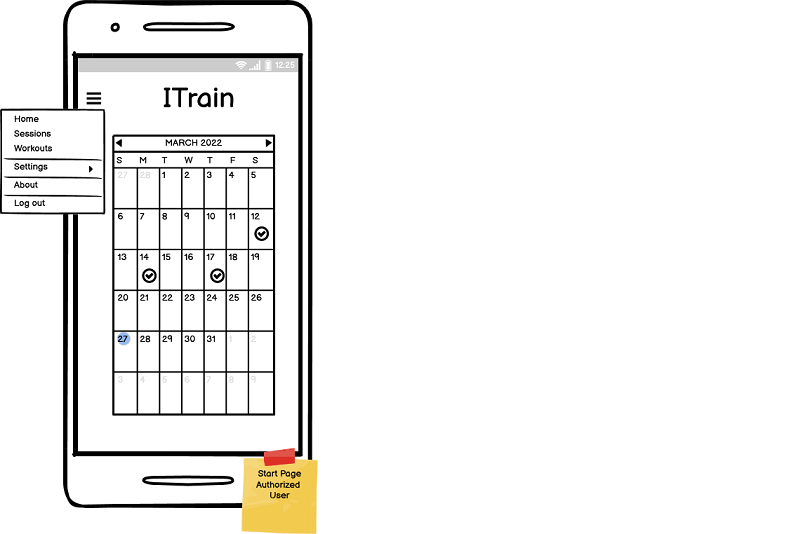
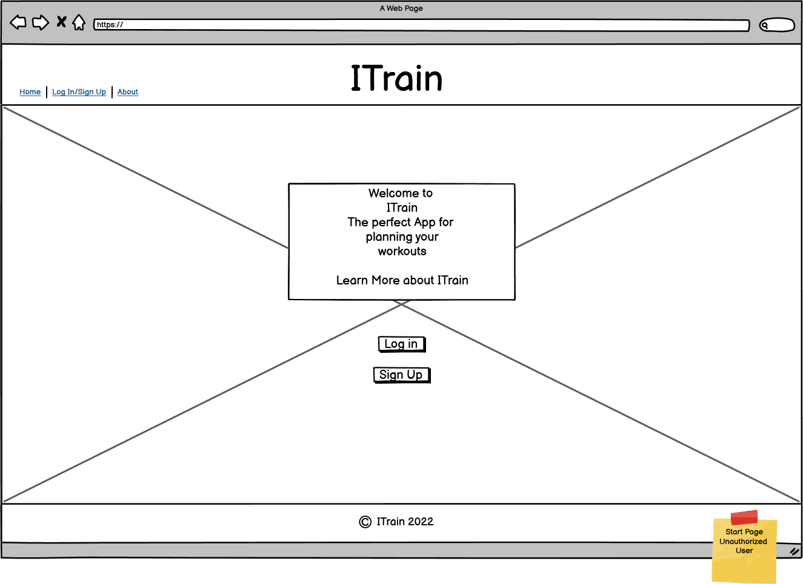

<h1 align="center">ITrain</h1>

Background image

This is a web based app made to give the user a simple but effective tool to plan and track their gym workouts.
It is flexible in the sense that the user can add all the exercises and workouts they want and don't need to use an app crowded with extra 
features that they will never use. 
....

[View the live project here](https://hj-itrain.herokuapp.com/).  

## Table of Contents
**[User Experience](#user-experience)**  
**[Planning the Project](#planning-the-project)**  
**[Features](#features)**  
**[Technologies Used](#technologies-used)**  
**[The Code](#the-code)**  
**[Testing](#testing)**  
**[Deployment](#deployment)**  
**[Credits](#credits)**  
**[Conclusion](#conclusion )** 

## User Experience
### Target Audience
The target audience for Itrain is people of all ages who regularly workout at a gym and who like to take control over their own training by planning their workouts.
The app gives the user the opportunity to create and edit exercises and put them together into workouts.
There are default exercises provided by an admin user, but apart from that all exercises and workouts are private and not shared between users.

The focus of this app is usability, both on a computer and on a mobile since it is important to be able to use the app at the gym and, for convenience, do the planning on a computer. Hence a fully responsive site is required.

### User Stories
#### Non Authorized Users
- As a non authorized user I am redirected to an informative page so that I immediately understand what the site is all about.
- As a non authorized user I get the opportunity to either sign up or log in so that I can use the features of the site.

#### Authorized Users
##### General
- As an authorized user I can easily navigate the site so that I feel comfortable with it and am likely to come back.
- *As an authorized user I can use a help tool so that I can understand how the app works.
- As an authorized user I can hover over a user symbol so that I can see the username of current logged in user.

##### Settings
* Exercises
    - As an authorized user I can create new exercises so that I can put them together in workouts.
    - As an authorized user I can edit an existing exercise.
    - *As an authorized user I can change the status of an existing exercise to inactive.
    - *As an authorized user I have access to a library of default exercises so that I don’t have to create them all.
    - As an authorized user I can tag an exercise so that I can filter exercises later.
* Tags and Muscle groups
    - As an authorized user I can create new tags so that I reuse them in exercises and workouts later.
    - As an authorized user I can create new muscle groups so that I reuse them in exercises later.

##### Workouts
- As an authorized user I can create new workouts and populate them with exercises so that I can reuse them in sessions.
- *As an authorized user I can use filters to easily find an exercise when I populate a workout.
- *As an authorized user I can tag a workout so that I can filter workouts later.
- *As an authorized user I can edit a workout so that I can update an existing workout.
- *As an authorized user I can change the status of an existing workout to inactive.

##### Sessions
- As an authorized user I can add a new session on today's date from the landing page so that I can easily use the app in the gym.
- As an authorized user I can add a new session on a future date so that I can plan my training.
- As an authorized user I can choose to populate a session with predefined workouts so that I can reuse the collection of workouts I have made.
- As an authorized user I can choose to populate a session with predefined exercises so that I can reuse the collection of exercises I have made.
- *As an authorized user I can use filters to easily find an exercise when I populate a session.
- *As an authorized user I can use filters to easily find a workout when I populate a session.
- **As an authorized user I can turn on notifications so that I get a reminder on the days when I have planned a session.
- As an authorized user I can find old sessions so that I can look back on my training history.
- **As an authorized user I can copy an old session to create a new one so that I can easily create a new session similar to an old one.
- As an authorized user I can edit an existing session.
- As an authorized user I can delete my sessions so that they are entirely gone from the database.
- As an authorized user I find a link to my next planned session on the landing page so that I can easily access it in the gym.

#### Authorized Users
- As an admin user I can make a library of categories, exercises and workouts so that all authorized users can access them.
- As an admin user I can create new units so that all users reuse them in exercises and workouts.
- As an admin user I can reset a user's password so that a user who lost their password still can access their saved data.

## Planning the Project
The planning of this project is done in Github Projects and follows an Agile strategy.
[Link to the project's Kanban Board](https://github.com/Odden69/ITrain/projects/1)
### Wireframes
The focus for this application is first and foremost on usability on a mobile devise, therefore all the wireframes are made for a mobile device and a large screen wireframe is added just to show the principal for larger screens.

  
Click to see the wireframes

Wireframes for Unauthorized Users  
  

Wireframe for the Landing Page of Authorized Users  
  

Wireframes for Sessions Pages  
  

Wireframes for the Workouts Pages  
  

Wireframes for Exercises Pages  
  

Wireframes for Muscle Groups and Tags Pages  
   

Wireframe for Landing Page on a Large screen
 

### Database Diagram
To illustrate the logic of the database I used [diagrams.net](https://www.diagrams.net/).  

## Features
### Existing Features

### Features Left to Implement

## Technologies Used

## Testing

### Testing User Stories from User Experience (UX) Section

#### Testing User's Goal

#### Testing Site Owner's Goal

### Known Bugs

## Deployment
### Clone a GitHub repository
To make a local copy of this project you can make a clone by following these steps:
- Log in to GitHub and find the [repository](https://github.com/Odden69/nonogram_game).
- Above the list of files click on the code button. By the https address there is a copy symbol, click on that.
- Open Git Bash
- Change the current working directory to the location where you want the cloned directory.
- Type "git clone", and paste in the copied URL.
- Press Enter to create your local clone.

### Deploy to Heroku
This site was deployed to Heroku Apps. To deploy a site, follow these steps:
- Make sure you have correct requirements.txt and Procfile committed and pushed before moving on with the deployment.
- Log in to [Heroku apps](https://heroku.com/)
- On the Heroku dashboard go to the "New" menu and choose "Create new app".
- Give the app a name that needs to be unique, select your region and click "Create app".
- Now the new app's dashboard is opened. Click on the settings tab.

## Credits
### Code

### Other

## Acknowledgements

## Conclusion

[Back to the top](#table-of-contents)